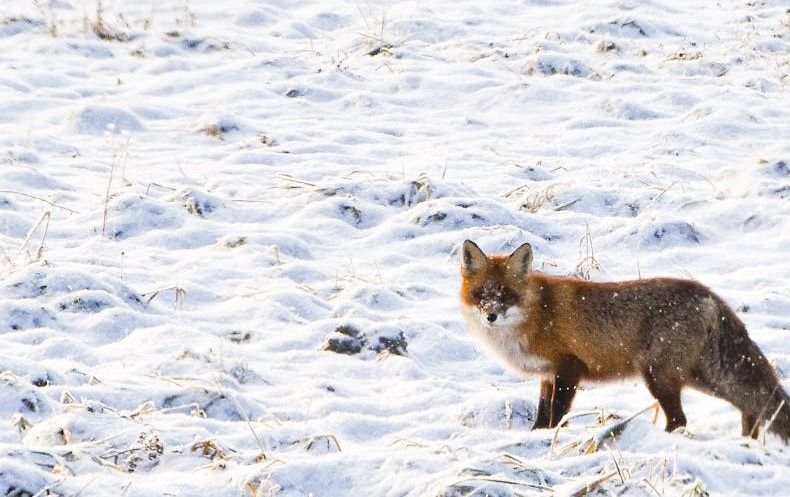

<h3 align="center">Classifox – Polish species classification app</h3>

Animal image classification app using a fine-tuned 
<a href="https://www.deepfaune.cnrs.fr/en/">DeepFaune model</a> 
for Polish species. 
Article describing the fine-tuning is in progress.

  

<h5 align="center">Installation</h5>

You can download the app package from <a href="...">here</a>.

<h5 align="center">Usage</h5>

After opening the app (classifox executable in app's directory), insert path to the directory with images to classify by clicking "Browse" button and click "Run classification" in order to start process.

If using CPU: 
you should set number of workers. If you have 16 core CPU, but want the PC not to freeze, workers should be set to around 12.

If using GPU: 
you should set batch size (number of concurent images processed) for the detector and the classifier, depending on your GPU VRAM and the size of images. If you set it too high, the app will raise error, telling you that. If you set it too low, the process will take a lot of time to finish.

GPU settings recommendations:
 - For 6GB VRAM and big images, the detector batch size should be about 10.
 - For 6GB VRAM and small images, the detector batch size could be even over 100.
 - For 6GB VRAM the classifier batch size can be 60 (should not depend on image size)

